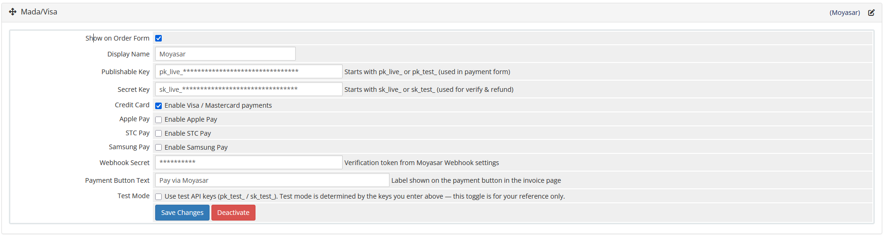
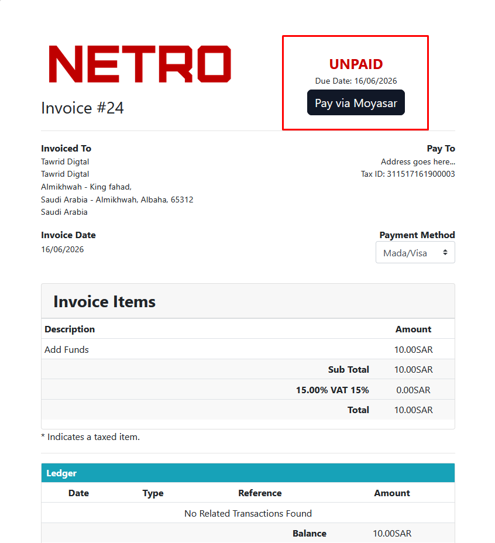
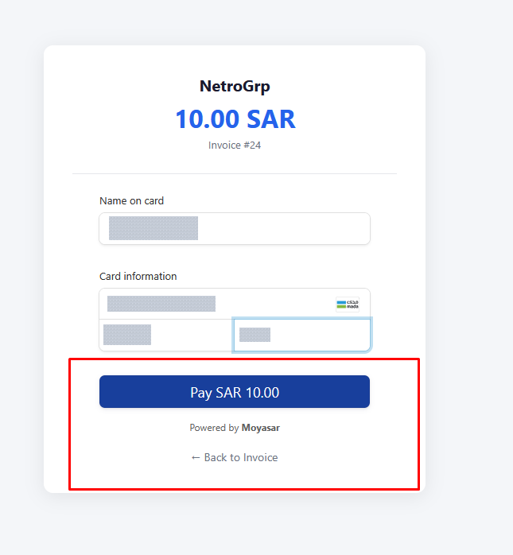

# Moyasar Payment Gateway for WHMCS

A modern payment gateway integration for WHMCS using Moyasar, supporting Credit Card, Apple Pay, STC Pay, and Samsung Pay.

**Version:** 1.1.0
**Requires:** WHMCS 7.0+
**Author:** Meshari Alomari

---

## Features

* Credit Card Payments (Visa & Mastercard)
* Apple Pay Support
* STC Pay Support
* Samsung Pay Support
* Refund Support via Moyasar API
* Webhook Verification & Security Validation
* Sandbox and Live Mode Support
* Configurable Payment Button Text
* Secure Payment Processing
* Invoice Ownership Validation
* Automatic Payment Status Updates

---

## Compatibility

| Component   | Version |
| ----------- | ------- |
| WHMCS       | 7.0+    |
| PHP         | 7.1+    |
| Moyasar API | Latest  |

---

## Requirements

* WHMCS 7.0 or later
* PHP 7.4 or later
* Active Moyasar Merchant Account
* Valid Moyasar API Keys

---

## Official Resources

* Website: https://moyasar.com/en/
* API Documentation: https://docs.moyasar.com/api/api-introduction
* Merchant Dashboard: https://dashboard.moyasar.com

---

## Installation

1. Upload the module files to your WHMCS installation while maintaining the folder structure:

```text
modules/
└── gateways/
    ├── moyasar.php
    └── callback/
        ├── moyasar.php
        └── moyasar_checkout.php
```

2. Login to your WHMCS Admin Area.
3. Navigate to:

```text
Configuration → System Settings → Payment Gateways
```

4. Activate **Moyasar**.
5. Enter your API credentials.
6. Configure the webhook endpoint.
7. Save the gateway settings.

---

## Configuration

| Setting             | Description                            |
| ------------------- | -------------------------------------- |
| Publishable Key     | Moyasar Publishable API Key            |
| Secret Key          | Moyasar Secret API Key                 |
| Webhook Secret      | Webhook verification token             |
| Credit Card         | Enable or Disable Credit Card payments |
| Apple Pay           | Enable or Disable Apple Pay            |
| STC Pay             | Enable or Disable STC Pay              |
| Samsung Pay         | Enable or Disable Samsung Pay          |
| Payment Button Text | Custom payment button label            |

---

## Webhook Configuration

Create a webhook from your Moyasar Dashboard using the following URL:

```text
https://yourdomain.com/modules/gateways/callback/moyasar.php?action=webhook
```

Enable the following webhook events:

* PAYMENT_PAID
* PAYMENT_FAILED
* PAYMENT_REFUNDED

Copy the generated Webhook Secret and add it to the gateway settings inside WHMCS.

---

## Apple Pay Configuration

Apple Pay requires domain verification.

Upload the verification file provided by Moyasar to:

```text
https://yourdomain.com/.well-known/apple-developer-merchantid-domain-association
```

For more information, please refer to the official Moyasar documentation.

---

## Screenshots

### Gateway Configuration



### Payment Checkout



### Invoice Payment



---

## Security

* Webhook requests are verified using the configured Webhook Secret.
* Payment requests are validated through the Moyasar API.
* Invoice ownership is verified before payment processing.
* Already-paid invoices are automatically redirected.
* Refund operations are executed through the Moyasar API using secure credentials.

---

## Changelog

See [CHANGELOG.md](CHANGELOG.md)

---

## License

MIT License

Copyright (c) 2026 Meshari Alomari

Permission is hereby granted, free of charge, to any person obtaining a copy of this software and associated documentation files (the "Software"), to deal in the Software without restriction, including without limitation the rights to use, copy, modify, merge, publish, distribute, sublicense, and/or sell copies of the Software.

---

## Support

For bug reports, feature requests, or contributions, please create an Issue in this repository.

For direct support and inquiries:

Email: [devphp03@gmail.com](mailto:devphp03@gmail.com)

Please include your WHMCS version, PHP version, and a detailed description of the issue when requesting support.


---

## Author

Meshari Alomari

